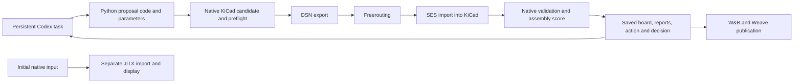

# PCB Loop: technical walkthrough and presentation Q&A

This describes the recorded hackathon implementation and evidence as of 2026-09-13. It distinguishes the demonstrated native board loop from the separate JITX research and the earlier simulation scaffold. Start with the [work index](README.md) for implementation branches, presentations, and research checkpoints.

## What the project demonstrated

Persistent Codex tasks wrote and revised Python experiments. Those experiments changed native PCB geometry, invoked full-board routing, and measured the saved result. Small and Medium produced valid reduced circuits under their recorded native checks. Large and the original/full circuit remained incomplete.

| Family | Components | Recorded outcome | Full-board routing path |
|---|---:|---|---|
| Small | 15 | Valid reduced circuit | Freerouting, through KiCad DSN/SES |
| Medium | 85 | Valid reduced circuit; best recorded score 35,365.44 | Freerouting, through KiCad DSN/SES |
| Large | 156 | Incomplete | Freerouting, through KiCad DSN/SES |
| Original / Full | 245 | Incomplete | Freerouting trials; earlier targeted repairs also used KiCadRoutingTools |

The reduced circuits are PCB Golf-inspired experiments, not accepted submissions of the original competition circuit. The recorded CAD checks do not establish manufactured or powered-hardware performance. The demonstrated score reduction does not prove global optimality or that one proposal policy generalizes to other boards.

## Corrected high-level flow



Preflight failures are recorded without sending illegal geometry to the router. Full evaluation still establishes why a candidate is rejected. Stage 1 seeks a valid board; Stage 2 retains only a strictly lower valid score. Historical post-feasibility policy trials remain in the record and must be labeled separately from the first-valid Stage 1 milestone.

## What prompted the agents?

The demonstrated Medium task received an initial instruction, a Stage 2 transition instruction, and later Coordinator messages. It was a persistent Codex task. A new agent was not spawned for every candidate, and there was no one fixed per-candidate API prompt.

Actual historical prompt exports:

- [Stage 1 task creation](prompts/stage-1-medium-initial.md)
- [Stage 2 transition of the same task](prompts/stage-2-medium-transition.md)
- [Selected subsequent update instructions](prompts/medium-update-followups.md)

For example, the initial prompt says:

> Outer iteration changes placement/topology, inner runs full-board enabled-layer autorouting then native evaluation.

These messages instructed a task that could inspect files, write code, execute commands, and evaluate results. Some resulting experiments generated a deterministic batch. There need not be another LLM inference between candidates in that batch. The prompt archive documents task instructions; it is not an exhaustive trace of model reasoning or proof that every requested capability was implemented. The action records and resulting artifacts establish what actually ran.

Prompt exports redact machine paths and task identifiers. Historical prompts can contain estimates or superseded plans: for example, the Stage 2 transition mentions a reported baseline estimate of 65,388, while the verified selected baseline used in the presentations is 65,288.00.

## Input and output of the update step

There are two distinct boundaries: the agent chooses an experiment, and the experiment runner evaluates concrete candidates.

| Boundary | Inputs | Outputs |
|---|---|---|
| Agent decision | Board/schematic, constraints, current best, score terms, previous actions and failure reports, task instructions | Python proposal code or edits, parameters, selected geometry source, experiment rationale, commands to execute |
| Candidate proposal | Selected native board, action parameters, project/rule/library/model context | Candidate native PCB geometry and proposal metadata |
| Route and evaluate | Candidate, allowed layers and via options, routing budget, validation contract | Routed board when routing runs; native reports, score terms, validity, commands/logs, keep/reject decision |
| Next agent decision | Saved result and diagnostic evidence | Revised experiment or another bounded batch |

Useful diagnostics include missing nets or pad islands, affected component groups, clearance failures, assembly overlap findings, and changes in the volume/via/layer score terms. These are inspected files and records, not a claim that each turn always received one serialized input object.

## Where the Medium design comes from

The demonstrated candidate path starts from native KiCad input. The JITX project is an imported representation of the initial input, not the source from which every evolving candidate is generated.

Source map on the public Medium branch:

| Script | Role |
|---|---|
| [build_input.py][build-input] | Defines the reduced circuit/input package derived from the original board |
| [native_input.py][native-input] | Uses `pcbnew` to apply declared poses and net assignments while retaining original footprint geometry |
| [jitx_input.py][jitx-input] | Creates the separate input import/build in JITX |
| [jitx/design.py][jitx-design] | Defines the imported `medium_loop.design.MediumLoopInput` design |
| [iterate.py][iterate] | Runs a Stage 1 placement update and records its result |
| [campaign.py][campaign] | Implements proposal/campaign and native realization support, including the resistor-swap trials |
| [stage2.py][stage2] | Creates spacing/outline proposals, runs routing and validation, computes score, and records retention |
| [grouped_input.py][grouped] | Creates functional-group placement proposals |
| [ground_escape_input.py][ground] | Creates a ground-escape topology proposal |
| [native_stage.py][native-stage] | Native export/import/audit operations |
| [shared_backend.py][backend] | Shared native acceptance adapter and its explicit gates |
| [copperhead_route.py][router] | Invokes the Freerouting path |

### Example: spacing and outline proposal

`stage2.py:proposal()` parses the selected board and changes component positions around a fixed center:

```python
x_new = 55 + (x_old - 55) * x_factor
y_new = 50 + (y_old - 50) * y_factor
```

The implementation rounds positions, recomputes bounds and edge margins, and writes a new outline. Component bodies and pad dimensions do not shrink. This spacing proposal removes prior copper and performs full routing again. Its action record explicitly declares that behavior; it should not be described as preserving and editing every earlier via in place.

Other proposals can introduce explicit net-attached topology, such as a ground-escape seed. Their copper-preservation behavior must be read from the actual proposal and request. Do not generalize the spacing proposal's full rip-up behavior to every topology experiment.

The runner copies the required project, schematic, libraries, and models into a candidate folder. After preflight, KiCad exports DSN, Freerouting produces SES, and KiCad imports the route into the candidate. `preview.kicad_pcb` captures the pre-routing state. The evaluated `pcbgolf.kicad_pcb` captures the state after routing/import and native processing.

## Were candidates routed in JITX?

No, the four-family demonstration used Freerouting for full-board routing. The Small/Medium/Large JITX projects imported and displayed initial boards. There is no per-candidate JITX project series for these demonstrated optimization runs.

For Medium, the separate local JITX input workspace is `.local/medium-loop/jitx`, with design `medium_loop.design.MediumLoopInput`. Its input contract explicitly says input import/build only, with no routed round-trip equivalence claim. Import and display are useful capabilities, but they are not candidate routing.

Separate public [JITX research][jitx-research] and [placement bridge work][bridge] contain bounded source-authored route/via and transfer experiments. Those results must be assessed against their own fixtures and checks. They do not establish a JITX optimization loop for the four demo families or completion of the original circuit.

## Does Freerouting choose layer transitions?

Freerouting supports routing across multiple enabled copper layers and can insert via transitions subject to the exported layer, via, and design-rule constraints. Placement does not have to preselect every transition. An experiment may also supply explicit topology, but automatic routing still has a separate role.

The retained Medium results in the presentations use two copper layers. The [Medium results report][results] also records a separate four-layer capability trial: both router and native connectivity reported 68 opens, so its score was null. A one-layer native persistence probe reloaded as two layers, so there is no valid one-layer scoring claim. Router capability, an experiment's allowed layer set, and a successful candidate are different facts.

## What is archived, and what changes in place?

Typical Medium Stage 2 location, relative to the experiment worktree:

```text
.local/medium-loop/stage2/<study>/candidate-NN/
    preview.kicad_pcb
    pcbgolf.kicad_pcb
    proposal.json
    event.json
    score.json
    native-audit.json
    drc.json
    erc.json
    ...project files, assembly data, command logs and reports...
```

Exact inventories vary by runner and study. The runner creates a new candidate directory for each attempt; it can update the candidate board during export/import/evaluation inside that directory. Completed candidates and named frozen checkpoints are retained. Study-level `events.json`, `current.json`, and status files are updated as a study progresses.

Python experiment scripts are edited in the working tree and versioned through Git. The runner does **not** automatically save a full copy of every Python script before each edit or inside every candidate directory. An event's `source_sha` identifies its recorded Git HEAD, but by itself does not prove the working tree was clean or capture uncommitted edits. The historical [results report][results] explicitly notes an ERC schema correction that was used before its commit in an early handoff. Candidate boards, action parameters, reports, hashes, and source commits provide evidence with these limits; they are not a blanket claim of perfectly reproducible source snapshots for every execution.

### Order and ancestry

The public [candidate ledger](medium-candidate-ledger.json) includes the Stage 1 diagnostic group move and 25 completed Stage 2 events, sorted by completion timestamp. Baselines, frozen duplicates, separate Stage 1 policy trials, and interrupted attempts without completed events are outside that count.

- `proposal_source` identifies the geometry transformed by the proposal.
- `parent_incumbent` identifies the comparison board for that study.
- `action` contains the primitive, parameters, poses and/or topology metadata.
- `result`, `retained`, and incumbent fields record evaluation and the study's decision.
- `commands`, timestamps, and `source_sha` connect the event to execution evidence.

Studies can overlap. Independent scale trials may transform the same baseline repeatedly rather than applying cumulative edits to the previous candidate. A candidate may improve a branch's incumbent without improving the best result across all branches. The presentation curve is the chronological minimum valid score across the completed Stage 2 record, not one linear geometry ancestry chain.

Ledger artifact paths refer to local experiment data, not public board downloads. Native candidate boards and bulky runtimes are not published by this documentation/presentation update.

## Native acceptance and score

The recorded evaluators check native connectivity and opens, DRC, schematic parity, ERC, rule preservation, net partitions, electrical footprint/pad geometry, allowed layers and widths/vias, model coverage, and assembly overlap screening as applicable to their runner. The shared adapter exposes these as explicit gates. A router exit code or lower proxy loss alone is not acceptance.

The assembly overlap screen uses conservative model bounding boxes. A detected box overlap can reject a candidate without proving a physical collision. Complete nominal model coverage is not the same as a detailed vendor model or real-board qualification.

For valid Stage 2 candidates:

```text
score = assembled PCBA bounding-box volume in mm³
      + 50 × via count
      + 5,000 × copper-layer count
```

Invalid candidates have a null qualifying score. Stage 2 keeps a candidate only if it is valid and its score is strictly lower than the compared incumbent; ties retain the incumbent. The initial spacing studies declared a 240-second/100-pass full-board route budget. Actual command durations come from logs. A declared budget is not the measured runtime of every attempt.

## Recorded results and their lineage

The Stage 1 diagnostic move translated R88/R89 by `(-15, -6)` mm and reduced the remaining open to zero under the reported checks. That first-feasible handoff is a separate branch from the later `accepted-best` used as the Stage 2 baseline. The latter followed resistor-swap trials and model-only packaging. Do not present the R88/R89 result as the direct geometry parent of every Stage 2 candidate.

| Score term | Stage 2 baseline | Best recorded Medium |
|---|---:|---:|
| Assembled volume (mm³) | 48,888.00 | 23,815.44 |
| Vias | 128 | 31 |
| Via penalty | 6,400 | 1,550 |
| Copper layers | 2 | 2 |
| Layer penalty | 10,000 | 10,000 |
| Total score | 65,288.00 | 35,365.44 |

The decrease is 29,922.56, or approximately 45.8%. The best recorded candidate is `stage2/edge-x-tight-01/candidate-01`.

The functional-grouping comparison in both talks uses an **intermediate pair**, not the baseline and final best:

| Candidate | Volume (mm³) | Vias | Score |
|---|---:|---:|---:|
| `continuation-01/candidate-02` | 32,510.52 | 148 | 49,910.52 |
| `functional-probe-01/candidate-01` | 33,895.68 | 29 | 45,345.68 |

Grouping reduced the via penalty by 5,950 while increasing volume by 1,385.16, for a net score improvement of 4,564.84, about 9.15%. Python proposed functional groups near their headers; Freerouting created the routed result. This is one measured useful intervention, not a general proof that a particular AI policy beats every alternative. The results report also records a comparison where independent-axis spacing did not beat uniform spacing.

## What W&B and Weave show

- [Initial Medium Stage 2 run][initial-run]
- [Medium continuation run][run]
- [Functional grouping evaluation record][trace]

W&B charts and artifacts connect score terms and candidate media to recorded results. The grouping Weave record exposes action/source information, commands/router evidence, and the result. The useful demonstration is to start with the grouping action, inspect its native result and score of 45,345.68, then locate the related board/report evidence.

These Medium evaluation traces were backfilled from completed experiment records. Their span duration is not routing runtime, and they are not per-candidate LLM inference traces. Use recorded command durations and router logs for execution timing. The last confirmed continuation upload reaches 40,074.08. Newer local results, including 35,365.44, are not established as uploaded by that receipt. W&B pages require access to the project; their URLs being in this public repository does not make the project public.

For presentation timing, the ten-minute [speaker notes](presentations/10min/Speaker-notes.md) reserve about 40 seconds of the W&B segment for navigation and include a fallback if login/loading is slow.

## What is public and what remains local

The work index links implementation branches, preserved source checkpoints, redacted prompts, the candidate action ledger, and both presentation packages. The decks and PDFs are copied from the reviewed local deliverables; the PDFs contain only the main talk, and the PowerPoints also contain hidden Q&A slides. The slides' source notes may reference original local evidence paths.

This update publishes documentation and presentation artifacts. It does not rerun native routing, upload missing W&B records, publish all native candidate boards, redistribute CAD/router runtimes, or establish a valid full competition board. Refer to the work index and each implementation's results report for the scope of its checks.

[build-input]: https://github.com/PhilippeFerreiraDeSousa/copper-scar/blob/codex/medium-pcb-loop/experiments/medium-loop/build_input.py
[native-input]: https://github.com/PhilippeFerreiraDeSousa/copper-scar/blob/codex/medium-pcb-loop/experiments/medium-loop/native_input.py
[jitx-input]: https://github.com/PhilippeFerreiraDeSousa/copper-scar/blob/codex/medium-pcb-loop/experiments/medium-loop/jitx_input.py
[jitx-design]: https://github.com/PhilippeFerreiraDeSousa/copper-scar/blob/codex/medium-pcb-loop/experiments/medium-loop/jitx/design.py
[iterate]: https://github.com/PhilippeFerreiraDeSousa/copper-scar/blob/codex/medium-pcb-loop/experiments/medium-loop/iterate.py
[campaign]: https://github.com/PhilippeFerreiraDeSousa/copper-scar/blob/codex/medium-pcb-loop/experiments/medium-loop/campaign.py
[stage2]: https://github.com/PhilippeFerreiraDeSousa/copper-scar/blob/codex/medium-pcb-loop/experiments/medium-loop/stage2.py
[grouped]: https://github.com/PhilippeFerreiraDeSousa/copper-scar/blob/codex/medium-pcb-loop/experiments/medium-loop/grouped_input.py
[ground]: https://github.com/PhilippeFerreiraDeSousa/copper-scar/blob/codex/medium-pcb-loop/experiments/medium-loop/ground_escape_input.py
[native-stage]: https://github.com/PhilippeFerreiraDeSousa/copper-scar/blob/codex/medium-pcb-loop/experiments/medium-loop/native_stage.py
[backend]: https://github.com/PhilippeFerreiraDeSousa/copper-scar/blob/codex/medium-pcb-loop/experiments/medium-loop/shared_backend.py
[router]: https://github.com/PhilippeFerreiraDeSousa/copper-scar/blob/codex/medium-pcb-loop/scripts/copperhead_route.py
[results]: https://github.com/PhilippeFerreiraDeSousa/copper-scar/blob/codex/medium-pcb-loop/experiments/medium-loop/RESULTS.md
[jitx-research]: https://github.com/PhilippeFerreiraDeSousa/copper-scar/tree/codex/jitx-optimization/integrations/jitx
[bridge]: https://github.com/PhilippeFerreiraDeSousa/copper-scar/tree/codex/placement-routing-bridge/integrations/placement_bridge
[initial-run]: https://wandb.ai/philippe-fdesousa/copper-scar/runs/medium-stage2-bca7861dec65
[run]: https://wandb.ai/philippe-fdesousa/copper-scar/runs/medium-stage2-continuation-20260913
[trace]: https://wandb.ai/philippe-fdesousa/copper-scar/weave/calls/4ea50c71-2ab3-549f-8917-d32b321e2fa7
